```mermaid
graph TD
    subgraph A [Without Safety Mechanism]
        direction LR
        A1(Fault Occurs) --> A2(Malfunctioning Behavior) --> A3(Hazardous Event)
        style A1 fill:#f9f,stroke:#333,stroke-width:2px
        style A3 fill:#f9f,stroke:#333,stroke-width:2px
    end

    subgraph B [Safety Mechanism Implemented]
        direction LR
        B1(Fault Occurs) --> B2(Fault Detected) --> B3(Safe State)
        style B1 fill:#f9f,stroke:#333,stroke-width:2px
        style B3 fill:#ccf,stroke:#333,stroke-width:2px
    end

    subgraph C [Safety Mechanism with Emergency Operation]
        direction LR
        C1(Fault Occurs) --> C2(Fault Detected) --> C3(Emergency Operation) --> C4(Safe State)
        style C1 fill:#f9f,stroke:#333,stroke-width:2px
        style C3 fill:#f8d,stroke:#333,stroke-width:2px
        style C4 fill:#ccf,stroke:#333,stroke-width:2px
    end

    linkStyle 0 stroke-width:2px,stroke:black,fill:none;
    linkStyle 1 stroke-width:2px,stroke:black,fill:none;
    linkStyle 2 stroke-width:2px,stroke:black,fill:none;
    linkStyle 3 stroke-width:2px,stroke:black,fill:none;
    linkStyle 4 stroke-width:2px,stroke:black,fill:none;
    linkStyle 5 stroke-width:2px,stroke:black,fill:none;
```

# FMEDA 圖片 AI 辨識報告

共 16 張圖片

## Revision_History_img0.jpeg
**Sheet**: Revision_History
**類型**: Logo
**描述**: 此圖片為慧榮科技（SiliconMotion）的公司標誌。標誌由一個藍色的立體方塊圖形和公司中英文名稱組成。左側的圖形是一個藍色漸層的立方體，其可見的兩個側面上以白色線條繪製了 stylized 的「S」和「M」字母，線條末端有圓點，呈現出電路般的設計感。右側是灰色的公司名稱，上方為「SiliconMotion」，下方為「慧榮科技股份有限公司」。
**在報告中的用途**: 這張圖片是公司的官方標誌，出現在 FMEDA 報告的「修訂歷史」工作表中，主要作用是標示文件的所有權和來源，表明該報告是由慧榮科技製作或與其相關。它作為頁首或品牌標識，確保了文件的專業性和可追溯性，讓閱讀者能立即識別文件發行單位。
**ISO 關聯**: 此標誌本身與 ISO 26262 或 IEC 61508 的技術要求沒有直接關聯。然而，它出現在 FMEDA 報告中，意味著這份文件是功能安全生命週期中的一個工作產出（Work Product）。根據 ISO 26262-8:2018 Clause 6（文件管理）的要求，所有文件都必須有清晰的識別和版本控制。公司標誌有助於識別文件來源，是文件管理與配置管理的一部分，確保了可追溯性與權威性，這間接支持了標準對於文件化流程的要求。

## Cover_img0.png
**Sheet**: Cover
**類型**: Logo
**描述**: 圖片為慧榮科技（SiliconMotion）的公司標誌。標誌主體是一個藍色的三維立方體，其可見的兩個側面上飾有白色的風格化線條，類似電子電路或晶片引腳的圖案。立方體下方是白色的公司名稱「SiliconMotion」，其中「Silicon」為標準字重，「Motion」為粗體。整個標誌位於純黑色背景之上。
**在報告中的用途**: 此圖片作為 FMEDA 報告封面上的公司標誌，其主要作用是品牌標識。它確立了文件的歸屬，表明該報告是由慧榮科技（SiliconMotion）製作或與其產品相關。在報告的開頭放置公司標誌，有助於建立企業形象，並讓讀者立即識別文件的來源。
**ISO 關聯**: 該公司標誌本身與 ISO 26262 或 IEC 61508 的技術內容沒有直接關聯。然而，它出現在 FMEDA 報告的封面上，象徵著這份文件以及其所分析的產品和流程，是在功能安全標準的框架下進行的。這表明該公司致力於遵循這些標準所要求的嚴格開發和安全分析流程，以確保其車用或工業用產品的安全性與可靠性。因此，這個標誌間接地將報告內容與功能安全標準的合規性聯繫起來。

## Process_img0.jpeg
**Sheet**: Process
**類型**: 流程圖
**描述**: 這是一張流程圖，用於指導硬體元件故障模式的分類。流程圖從左上角的「HW element, λ」方塊開始，代表一個具有總失效率 λ 的硬體元件。

1.  第一個判斷菱形「Safety-related HW element?」詢問該元件是否與安全相關。
    *   如果「no」，則流程指向「Non safety-related faults-not included in the analysis」方塊，表示此類故障不納入分析。
    *   如果「yes」，則流程指向一系列「Failure mode, λmode_i, λmode_i+1, ...」方塊，表示需分析其各種故障模式。

2.  接下來的判斷菱形「Potential to violate a SG, in absence of safety mechanism?」詢問在沒有安全機制的狀況下，此故障模式是否可能違反安全目標（SG）。
    *   如果「yes」，流程進入下一個判斷菱形「Is there any safety mechanism in place to control failure modes of the HW element?」，詢問是否有安全機制來控制此故障。
        *   如果「yes」，則進入橢圓形「How much coverage is provided by the safety mechanism, w.r.t. residual faults?」，評估安全機制的覆蓋率。有被覆蓋的部分（% covered by safety mechanism）被歸類為單點故障（λ_SPF）；未被覆蓋的部分（% not covered by safety mechanism）被歸類為殘餘故障（λ_RF）。
        *   如果「no」，則該故障直接被歸類為單點故障（λ_SPF）。
    *   如果「no」，流程向右移動到下一個判斷菱形「Potential to violate a SG, in combination w/ one other independent fault?」，詢問此故障是否可能與另一個獨立故障結合而違反安全目標。
        *   如果「no」，則該故障被歸類為安全故障（λ_S），雖然納入分析，但性質不同。
        *   如果「yes」，流程進入下一個判斷菱形「Are mechanisms in place to prevent latent faults or can the driver perceive the effects?」，詢問是否有機制能防止潛在故障，或駕駛員能否感知其影響。
            *   如果「no」，則該故障被歸類為潛在多點故障（λ_MPF, L）。
            *   如果「yes」，則進入橢圓形「How much coverage is offered by safety mechanism, or driver perception, w.r.t. latent faults?」，評估安全機制或駕駛員感知的覆蓋率。有被覆蓋的部分（% covered）被歸類為已偵測到的多點故障（λ_MPF, DP）；未被覆蓋的部分（% not covered）被歸類為潛在多點故障（λ_MPF, L）。

圖中所有流程最終都將元件的總失效率 λ 分配到不同的故障類別中：λ_SPF（單點故障）、λ_RF（殘餘故障）、λ_MPF, L（潛在多點故障）、λ_MPF, DP（已偵測多點故障）和 λ_S（安全故障）。
**在報告中的用途**: 此流程圖在 FMEDA 報告中的核心作用是提供一個標準化、可視化的決策流程，用以指導分析人員如何根據 ISO 26262 標準對硬體元件的每個故障模式進行分類。它確保了故障分類的一致性與準確性，是計算單點故障度量（SPFM）和潛在故障度量（LFM）這兩個關鍵硬體架構度量的基礎。透過這個流程，報告能夠清晰地展示每個故障率（λ）如何被分配到單點故障（SPF）、殘餘故障（RF）或多點故障（MPF），從而證明系統的硬體設計滿足所需的安全等級（ASIL）要求。
**ISO 關聯**: 這張流程圖與 ISO 26262-5:2018（道路車輛-功能安全-第五部分：硬體層面的產品開發）緊密相關。它完整體現了標準中對於硬體故障分類的核心邏輯。

1.  **故障分類**: 流程圖中的決策點完全對應 ISO 26262 對於單點故障（Single-Point Fault）、殘餘故障（Residual Fault）和多點故障（Multiple-Point Fault）的定義。它引導使用者判斷一個故障是否直接違反安全目標（潛在的單點故障），或者是否需要與其他故障結合才會違反安全目標（潛在的多點故障）。

2.  **硬體架構度量**: 流程的最終輸出——λ_SPF, λ_RF, λ_MPF,L, λ_MPF,DP——是計算硬體架構度量的直接輸入。根據 ISO 26262，單點故障度量（SPFM）和潛在故障度量（LFM）是評估硬體架構容錯能力的主要指標。此流程圖正是為了系統性地得到計算這些度量所需的各類故障率總和。

3.  **安全機制與診斷覆蓋率（DC）**: 圖中多次提到「safety mechanism」和「coverage」，這對應了 ISO 26262 中安全機制的概念以及對其有效性（即診斷覆蓋率，Diagnostic Coverage）的評估要求。流程圖指導分析師根據安全機制的覆蓋率，將故障率分配到不同的類別中（例如，被覆蓋的部分成為單點故障，未被覆蓋的成為殘餘故障）。

總之，此圖是將 ISO 26262 的抽象定義轉化為一個具體、可操作的工程實踐指南，是執行 FMEDA 以符合標準要求的關鍵步驟。

```
graph TD
    A[HW element, λ] --> B{Safety-related HW element?};
    B -- no --> C[Non safety-related faults-not included in the analysis];
    B -- yes --> D[Failure modes, λmode_i, ...];
    D --> E{Potential to violate a SG, in absence of safety mechanism?};
    E -- yes --> F{Is there any safety mechanism in place?};
    F -- no --> G[λ_SPF];
    F -- yes --> H{How much coverage?};
    H -- % covered --> G;
    H -- % not covered --> I[λ_RF];
    E -- no --> J{Potential to violate a SG, in combination w/ another fault?};
    J -- no --> K[λ_S (Included in the analysis)];
    J -- yes --> L{Are mechanisms in place to prevent latent faults or can driver perceive?};
    L -- no --> M[λ_MPF, L];
    L -- yes --> N{How much coverage?};
    N -- % covered --> O[λ_MPF, DP];
    N -- % not covered --> M;
```

## Definitions_img0.jpeg
**Sheet**: Definitions
**類型**: 定義圖
**描述**: 這張圖片包含了三個時間軸圖，用以說明功能安全中與故障相關的時間間隔概念。

第一個時間軸（最上方）標示為「無安全機制」(Without Safety Mechanism)。它展示了一個從「導致項目發生故障行為的故障」(Fault causing malfunctioning behavior of the item) 開始的時間序列。這個故障引發了持續一段時間的「故障行為」(Malfunctioning Behavior)，最終導致「導致危險事件的故障行為」(Malfunctioning behavior resulting in hazardous event)。從故障發生到危險事件發生的整個時間區間被定義為「容錯時間間隔」(Fault Tolerant Time Interval)。

第二個時間軸（中間）標示為「已實施安全機制」(Safety Mechanism Implemented)。它同樣從一個故障點開始，但展示了安全機制介入後的情境。故障發生後，系統透過多次「診斷測試時間間隔」(Diagnostic Test Time Intervals) 來偵測故障，偵測到故障所需的時間為「故障偵測時間」(Time to Detect Fault)，整個區間稱為「故障偵測時間間隔」(Fault Detection Time Interval)。偵測到故障後，系統會花費「轉換到安全狀態的時間」(Time to Transition to Safe State) 進入「安全狀態」(Safe State)。從偵測到故障到進入安全狀態的這段時間被定義為「故障反應時間間隔」(Fault Reaction Time Interval)。從最初故障發生到系統完全進入安全狀態的總時間，則被稱為「故障處理時間間隔」(Fault Handling Time Interval)。

第三個時間軸（最下方）標示為「已實施帶有緊急操作的安全機制」(Safety Mechanism Implemented with Emergency Operation)。這個情境與第二個類似，但在偵測到故障後，系統首先進入「緊急操作」(Emergency Operation) 模式，這段轉換時間是「轉換到緊急操作的時間」(Time to Transition to Emergency Operation)。系統會在「緊急操作時間間隔」(Emergency Operation Time Interval) 內維持運作，之後再「轉換到安全狀態」(Transition to Safe State)。整個從故障偵測到進入緊急操作，再到最後進入安全狀態的過程，其時間跨度同樣由「故障反應時間間隔」和「故障處理時間間隔」來定義。
**在報告中的用途**: 這張圖在 FMEDA 報告中的主要作用是視覺化並明確定義與故障處理相關的各個關鍵時間參數。在功能安全分析中，確保系統能夠在「容錯時間間隔」（FTTI）內偵測到故障並轉換至安全狀態至關重要。此圖清楚地劃分了「故障處理時間間隔」（FHTI）的組成部分，包括「故障偵測時間間隔」和「故障反應時間間隔」。

透過這些定義，FMEDA 分析師可以：
1.  **量化時間要求**：為安全機制的診斷測試和反應動作設定明確的時間目標。
2.  **評估設計**：評估系統設計是否能在規定的時間內有效應對故障，防止危險事件發生。
3.  **計算安全指標**：這些時間參數是計算硬體架構指標（如 SPFM 和 LFM）時的基礎，因為診斷覆蓋率（DC）的有效性與診斷測試的頻率（即診斷測試時間間隔）密切相關。它為整個 FMEDA 分析提供了統一的時間模型框架。
**ISO 關聯**: 此圖中定義的時間間隔與 ISO 26262 和 IEC 61508 標準的核心概念直接相關。

1.  **容錯時間間隔 (Fault Tolerant Time Interval, FTTI)**：這是 ISO 26262 的一個關鍵概念，尤其在 Part 3 (概念階段) 和 Part 4 (系統層級開發) 中被強調。它定義了從故障發生到可能引發違反安全目標的危險事件之間的時間窗口。系統必須在此時間內完成故障的偵測與應對。

2.  **故障處理時間間隔 (Fault Handling Time Interval, FHTI)**：ISO 26262-5:2018 (硬體層級開發) 中明確定義了 FHTI。標準要求 FHTI 必須小於 FTTI (FHTI < FTTI)，以確保系統的安全性。此圖詳細分解了 FHTI，顯示它由「故障偵測時間間隔」和「故障反應時間間隔」組成，這與標準的定義完全一致。

3.  **診斷測試時間間隔 (Diagnostic Test Interval, DTI)**：圖中顯示的「Diagnostic Test Time Intervals」直接對應於 ISO 26262 中的 DTI。DTI 是指安全機制執行診斷以偵測潛在故障的頻率。這個時間間隔的長短直接影響到「診斷覆蓋率」(Diagnostic Coverage, DC) 的有效性，進而影響到單點故障指標 (SPFM) 和潛在故障指標 (LFM) 的計算結果。

總之，這張圖為 FMEDA 報告提供了符合 ISO 26262 標準的通用詞彙和時間模型，是進行硬體安全分析與量化評估的基礎。

```

```

## Definitions_img1.jpeg
**Sheet**: Definitions
**類型**: 流程圖
**描述**: 此圖片展示了一個故障傳播的因果鏈。圖中包含兩個主要區塊，分別標示為「Element A」和「Element B」。

在「Element A」區塊中：
- 一個來自外部的「Root Cause (external)」箭頭指向一個名為「Fault 1」的方塊。
- 區塊底部標示著「Root Cause (internal)」，暗示內部也可能存在故障源。
- 「Element A」內部存在兩個「Fault 1」實例，它們各自產生一個名為「Failure A」的輸出。

在「Element B」區塊中：
- 來自「Element A」的兩個「Failure A」輸出，分別成為「Element B」內部兩個「Fault 2」實例的輸入。
- 這兩個「Fault 2」實例各自產生一個名為「Failure B」的輸出。

整個流程圖清晰地描繪了故障如何從一個初始的根本原因（無論是外部還是內部），在一個元件（Element A）中顯現為故障（Fault 1），接著導致該元件的失效（Failure A），而這個失效又會傳播到下一個元件（Element B），觸發新的故障（Fault 2），並最終導致下一個元件的失效（Failure B）。
**在報告中的用途**: 這張圖片在 FMEDA 報告中的主要作用是視覺化地定義和區分幾個核心概念，包括「根本原因 (Root Cause)」、「故障 (Fault)」和「失效 (Failure)」，並闡明它們之間的傳播關係。它旨在說明一個系統或元件的失效（Failure）通常是由另一個潛在的故障（Fault）所引起，而這個故障本身又有其根本原因。此圖透過展示一個從 Element A 到 Element B 的級聯效應，幫助分析人員理解單點故障如何影響系統的其他部分，是建立整個 FMEDA 分析模型、追蹤失效模式及其影響的基礎。
**ISO 關聯**: 這張圖與 ISO 26262 和 IEC 61508 標準緊密相關。這兩個標準都強調了對電子電氣系統進行系統性安全分析的重要性，其中失效模式與影響分析（FMEA）及其量化擴展 FMEDA 是核心方法之一。

1.  **ISO 26262 (道路車輛 - 功能安全):** 在 Part 5 (硬體層級的產品開發) 中，標準要求進行硬體架構度量（如 SPFM、LFM）和隨機硬體失效導致違反安全目標的評估（如 PMHF）。這張圖所展示的故障傳播概念，是理解和計算這些度量的基礎。它有助於識別「單點故障 (Single-Point Fault)」、「殘餘故障 (Residual Fault)」和「多點故障 (Multiple-Point Fault)」，並評估安全機制的有效性。

2.  **IEC 61508 (電氣/電子/可程式化電子安全相關系統的功能安全):** 作為功能安全的基礎標準，IEC 61508 同樣要求對硬體可靠性進行評估。圖中展示的因果鏈分析方法，是實現硬體安全完整性（Hardware Safety Integrity）要求的關鍵步驟，用於確定安全完整性等級（SIL）所需的硬體容錯能力和安全的失效比例（Safe Failure Fraction, SFF）。

總之，此圖闡述了執行 FMEDA 時的基本思維模型，即追蹤從根本原因到系統級失效的完整路徑，這是滿足 ISO 26262 和 IEC 61508 對硬體安全分析要求的核心實踐。

```
graph LR
    subgraph Element A
        direction TB
        A1[Element A]
        F1_1[Fault 1]
        F1_2[Fault 1]
    end

    subgraph Element B
        direction TB
        B1[Element B]
        F2_1[Fault 2]
        F2_2[Fault 2]
    end

    RC_ext[Root Cause<br/>(external)] --> F1_1
    note right of F1_2 : Root Cause<br/>(internal)

    F1_1 -->|Failure A| F2_1
    F1_2 -->|Failure A| F2_2

    F2_1 -->|Failure B| EndB1[Failure B]
    F2_2 -->|Failure B| EndB2[Failure B]

    style EndB1 fill-opacity:0,stroke-width:0,color:white
    style EndB2 fill-opacity:0,stroke-width:0,color:white
```

## Definitions_img2.jpeg
**Sheet**: Definitions
**類型**: 定義圖
**描述**: 此圖片為一個區塊圖，用以闡釋「共因失效」（Common Cause Failure）的概念。圖中顯示一個「外部根本原因」（Root Cause (external)）指向兩個獨立的系統單元：「元件 A」（Element A）和「元件 B」（Element B）。在元件 A 的區塊內，此外部原因導致了兩個「故障 1」（Fault 1），而每一個故障都引發了「失效 A」（Failure A）。同樣地，在元件 B 的區塊內，該外部原因也導致了兩個「故障 2」（Fault 2），並各自引發了「失效 B」（Failure B）。整個圖示清晰地表達了一個單一的外部事件如何引發多個看似無關的內部故障，從而導致不同元件的失效。
**在報告中的用途**: 此圖在 FMEDA 報告中的主要作用是定義與視覺化「共因失效」（Common Cause Failure, CCF）此一關鍵的可靠性概念。它清楚地展示了一個單一的根本原因（特別是源於外部環境或共享資源的因素）如何繞過系統設計中的獨立性或冗餘性，同時在多個不同的元件中觸發故障。在功能安全分析中，識別並評估 CCF 至關重要，因為這類失效會導致主要功能與其安全機制同時失效，從而嚴重違反安全目標。因此，這張圖為分析人員提供了一個共同的理解基礎，以利後續在 FMEDA 表格中進行相關的失效模式分析與量化評估。
**ISO 關聯**: 此圖直接關聯於 ISO 26262 的多個部分，特別是 Part 5（硬體層面的產品開發）與 Part 9（以 ASIL 和安全為導向的分析）。標準中明確要求必須執行「相依性失效分析」（Dependent Failure Analysis, DFA），其中就包含了對「共因失效」（CCF）的識別與分析。ISO 26262 規定，為了確保系統的安全性，必須證明不同元件之間的獨立性，或採取適當的措施來減輕相依性失效的影響，以滿足目標 ASIL 等級的要求。此圖所描繪的情境——一個單一原因導致多重失效——正是 DFA 所要處理的核心問題。因此，理解此概念是執行符合 ISO 26262 標準的 FMEDA 的前提。

```
graph TD
    subgraph 元件 A (Element A)
        direction LR
        F1A[故障 1] --> FailA1(失效 A)
        F1B[故障 1] --> FailA2(失效 A)
    end
    subgraph 元件 B (Element B)
        direction LR
        F2A[故障 2] --> FailB1(失效 B)
        F2B[故障 2] --> FailB2(失效 B)
    end

    ExtRC(外部根本原因<br/>Root Cause (external)) --> F1A
    ExtRC --> F1B
    ExtRC --> F2A
    ExtRC --> F2B
```

## FlowChart_img0.jpeg
**Sheet**: FlowChart
**類型**: 流程圖
**描述**: 這是一張詳細的流程圖，用於說明硬體元件在功能安全分析中，如何根據其故障模式（Failure Mode）進行分類與計算其失效率（Failure Rate）。整個流程始於一個「故障模式」，並根據一系列的決策點與計算公式，將其最終歸類為不同類型的故障。

流程圖的主要路徑如下：
1.  **起始點**：從「Failure mode」開始。
2.  **計算初始失效率**：計算故障模式的總失效率 `λ_FM = λ x D_FM`。
3.  **安全性相關判斷**：判斷此硬體元件是否為「Safety related」。
    *   若否，則歸類為「Non safety-related fault」，其失效率為 `λ_FM,nSR = λ_FM`。
    *   若是，則進入下一步，其失效率為 `λ_FM,SR = λ_FM`。
4.  **安全故障比例判斷**：判斷故障中有多少比例是「安全故障 (safe faults)」。
    *   安全的部分，其失效率為 `λ_FM,S = F_FM,safe x λ_FM,SR`，並歸類為「Safe fault」。
    *   不安全的部分，其失效率為 `λ_FM,nS = (1 - F_FM,safe) x λ_FM,SR`，進入下一步分析。
5.  **潛在違規判斷**：判斷在沒有安全機制的狀況下，故障是否「有潛力直接違反安全目標 (potential to directly violate the safety goal)」。
    *   若無潛力，則視為「多點故障的主要部分 (multi-point fault primary)」，其失效率為 `λ_FM,MPF,primary = (1 - F_FM,PVSG) x λ_FM,nS`，並流向多點故障的計算。
    *   若有潛力，則計算其違反安全目標的失效率 `λ_FM,PVSG = F_FM,PVSG x λ_FM,nS`。
6.  **安全機制判斷**：判斷是否有安全機制來控制此故障模式。
    *   若無，則此故障為「單點故障 (Single Point Fault)」，其失效率為 `λ_FM,SPF = λ_FM,PVSG`。
    *   若有，則進入下一步。
7.  **安全機制有效性判斷**：判斷安全機制能「防止直接違反安全目標」的比例。
    *   若能防止，則此部分為「多點故障的次要部分 (multi-point fault secondary)」，其失效率為 `λ_FM,MPF,secondary = K_FMCI,RF x λ_FM,PVSG`，並流向多點故障的計算。
    *   若無法防止，則此部分為「殘餘故障 (Residual Fault)」，其失效率為 `λ_FM,RF = (1 - K_FMCI,RF) x λ_FM,PVSG`。
8.  **多點故障 (Multi-Point Fault, MPF) 分類**：
    *   首先，匯總主要與次要部分，計算總多點故障失效率 `λ_FM,MPF = λ_FM,MPF,primary + λ_FM,MPF,secondary`。
    *   接著判斷其是否被「偵測 (detected)」。
        *   被偵測的部分，歸類為「MPF, detected」，其失效率為 `λ_FM,MPF,det = K_FMCI,MPF x λ_FM,MPF`。
        *   未被偵測的部分，其失效率為 `λ_FM,MPF,pl = (1 - K_FMCI,MPF) x λ_FM,MPF`，進入下一步。
    *   再判斷未被偵測的部分是否能被「感知 (perceived)」。
        *   能被感知的部分，歸類為「MPF, perceived」，其失效率為 `λ_FM,MPF,p = F_FM,per x λ_FM,MPF,pl`。
        *   不能被感知的部分，歸類為「MPF, latent (潛在故障)」，其失效率為 `λ_FM,MPF,l = (1 - F_FM,per) x λ_FM,MPF,pl`。

圖中的方塊代表各個狀態或計算結果，菱形代表決策點，箭頭則表示流程方向。每個計算公式都明確定義了各種故障類別的失效率是如何從上一級推導出來的。
**在報告中的用途**: 在 FMEDA（故障模式、影響與診斷分析）報告中，這張流程圖扮演著核心方法論的角色，其主要作用與意義如下：

1.  **視覺化呈現故障分類邏輯**：它將 ISO 26262 標準中複雜抽象的文字定義，轉化為一個清晰、直觀的視覺化流程。這使得分析師、審核員以及團隊其他成員能夠快速理解並遵循一個標準化的方法來評估硬體元件的各種故障模式。

2.  **指導失效率計算**：圖中的每個步驟都伴隨著一個明確的計算公式。它指導分析師如何基於元件的總失效率（λ）、分配因子（Distribution Factor, D_FM）、安全故障比例（F_FM,safe）、安全機制覆蓋率（K-factors）等參數，一步步計算出單點故障（SPF）、殘餘故障（RF）和多點故障（MPF）的失效率（λ_SPF, λ_RF, λ_MPF）。

3.  **確保分析的一致性與可追溯性**：透過提供一個固定的分析框架，這張圖確保了所有元件和所有分析師都採用相同的方法進行評估，從而保證了整個 FMEDA 分析結果的一致性。同時，當審查分析結果時，可以輕易地追溯每個故障率的來源與計算過程，提高了分析的可信度與可稽核性。

4.  **支持硬體指標計算**：流程圖的最終產出（各類故障的失效率）是計算單點故障指標（SPFM）和潛在故障指標（LFM）的直接輸入。這兩個指標是衡量硬體設計在功能安全方面穩健性的關鍵量化指標，是判斷是否滿足目標 ASIL 等級的必要條件。

總之，這張流程圖不僅是一個說明性的圖表，更是 FMEDA 分析工作的核心計算引擎與方法論指南，確保了整個分析過程的嚴謹性、標準化與可追溯性。
**ISO 關聯**: 此流程圖直接對應 ISO 26262-5:2018 標準中附件 E (Annex E) 所描述的「硬體架構量化評估方法」。它詳細闡述了如何將一個硬體元件的總失效率（λ）根據其故障模式的影響，系統性地分配到不同的故障類別中，包括安全相關故障、非安全相關故障、單點故障、殘餘故障以及多點故障（包含被偵測、被感知和潛在的）。這個分類過程是計算硬體架構指標（Hardware Architectural Metrics），即單點故障指標（SPFM）和潛在故障指標（LFM）的基礎，這兩個指標是證明硬體設計滿足特定汽車安全完整性等級（ASIL）要求的關鍵證據。因此，這張圖是實施 ISO 26262 標準中 FMEDA 方法的核心邏輯。

```
graph TD
    A["Failure mode"] --> B["λ_FM = λ x D_FM"];
    B --> C{"Safety related HW element to be considered in the analyses?";
    C -- no --> D["λ_FM,nSR = λ_FM"];
    D --> E["Non safety-related fault"];
    C -- yes --> F["λ_FM,SR = λ_FM"];
    F --> G{"Fraction of faults that are safe (F_FM,safe)?"};
    G -- safe --> H["λ_FM,S = F_FM,safe x λ_FM,SR"];
    H --> I["Safe fault"];
    G -- not safe --> J["λ_FM,nS = (1 - F_FM,safe) x λ_FM,SR"];
    J --> K{"Fraction of faults that in absence of a safety mechanism have<br/>the potential to directly violate the safety goal (F_FM,PVSG)?"};
    K -- no potential --> L["λ_FM,MPF,primary = (1 - F_FM,PVSG) x λ_FM,nS"];
    K -- potential --> M["λ_FM,PVSG = F_FM,PVSG x λ_FM,nS"];
    M --> N{"Are there safety mechanisms in place to control faults for at<br/>least one failure mode of the element (yes / no)?"};
    N -- no --> O["λ_FM,SPF = λ_FM,PVSG"];
    O --> P["Single Point Fault"];
    N -- yes --> Q["λ_FM,PVSG"];
    Q --> R{"Fraction of faults that the safety mechanism prevents<br/>from directly violating the safety goal (K_FMCI,RF)?"};
    R -- Violation prevented --> S["λ_FM,MPF,secondary = K_FMCI,RF x λ_FM,PVSG"];
    R -- Violation not prevented --> T["λ_FM,RF = (1 - K_FMCI,RF) x λ_FM,PVSG"];
    T --> U["Residual Fault"];
    L --> V["λ_FM,MPF = λ_FM,MPF,primary + λ_FM,MPF,secondary"];
    S --> V;
    V --> W{"Fraction of multi-point faults that are detected (K_FMCI,MPF)?"};
    W -- detected --> X["λ_FM,MPF,det = K_FMCI,MPF x λ_FM,MPF"];
    X --> Y["MPF, detected"];
    W -- not detected --> Z["λ_FM,MPF,pl = (1 - K_FMCI,MPF) x λ_FM,MPF"];
    Z --> AA{"Fraction of multi-point faults that are perceived (F_FM,per)?"};
    AA -- perceived --> AB["λ_FM,MPF,p = F_FM,per x λ_FM,MPF,pl"];
    AB --> AC["MPF, perceived"];
    AA -- not perceived --> AD["λ_FM,MPF,l = (1 - F_FM,per) x λ_FM,MPF,pl"];
    AD --> AE["MPF, latent"];
```

## FlowChart_img1.jpeg
**Sheet**: FlowChart
**類型**: 流程圖
**描述**: 此圖片為一個流程圖，用於分類硬體元件（HW element）的失效模式。圖表頂端是「Failure mode of a HW element」（硬體元件的失效模式），由此向下分為兩大分支：

1.  左側分支為「Failure modes of a non safety-related HW element」（非安全相關硬體元件的失效模式），其唯一的結果是「Non safety-related fault」（非安全相關故障）。

2.  右側分支為「Failure modes of a safety-related HW element」（安全相關硬體元件的失效模式），此分支進一步細分為五種類型的故障：
    *   「Safe fault」（安全故障）
    *   「Detected multiple-point fault」（被偵測到的多點故障）
    *   「Perceived multiple-point fault」（可被感知到的多點故障）
    *   「Latent multiple-point fault」（潛在多點故障）
    *   「Residual fault / Single-point fault」（殘餘故障／單點故障）

整個圖表以樹狀結構清晰地展示了硬體元件失效模式從一般到具體的分類層級，特別是區分了與安全相關和與安全無關的故障路徑。
**在報告中的用途**: 在 FMEDA（失效模式、影響與診斷分析）報告中，此流程圖扮演著基礎性的分類指南角色。其主要作用是為報告的讀者提供一個清晰的視覺化框架，說明任何硬體元件的潛在失效模式將如何根據其對系統安全的影響而被歸類。這個分類是後續進行定量安全分析（例如計算 SPFM 和 LFM 等安全指標）的基礎。透過此圖，分析人員和審核者可以確保所有故障都已根據標準化的定義被正確分類，從而保證 FMEDA 分析的一致性與準確性。
**ISO 關聯**: 此故障分類流程圖與功能安全標準 **ISO 26262（道路車輛－功能安全）** 的要求完全一致，特別是 Part 5（硬體層面的產品開發）中關於硬體架構指標（Hardware Architectural Metrics）的計算方法。圖中定義的各種故障類型，如**單點故障（Single-point fault）**、**殘餘故障（Residual fault）**和**潛在故障（Latent fault）**，都是 ISO 26262 的核心概念。這些分類是計算單點故障指標（SPFM）和潛在故障指標（LFM）的基礎，用以評估硬體設計對於隨機硬體失效的穩健性。此分類法也與基礎功能安全標準 **IEC 61508** 的原則相符，該標準為特定行業標準（如 ISO 26262）提供了框架和基本概念。

```
graph TD
    A["Failure mode of a HW element"] --> B["Failure modes of a non safety-related<br>HW element"];
    A --> C["Failure modes of a safety-related<br>HW element"];
    B --> D["Non safety-related fault"];
    C --> E["Safe fault"];
    C --> F["Detected multiple-point fault"];
    C --> G["Perceived multiple-point fault"];
    C --> H["Latent multiple-point fault"];
    C --> I["Residual fault / Single-point fault"];
```

## FlowChart_img2.jpeg
**Sheet**: FlowChart
**類型**: 流程圖
**描述**: 這是一張詳細的流程圖，用於指導硬體元件（HW element）的故障模式分類。圖表從一個標示為「HW element, λ」的方塊開始，其中 λ 代表該元件的總失效率。

流程的第一個決策點是一個菱形，提問「Safety-related HW element?」（是否為安全相關硬體元件？）。
- 如果答案為「no」，流程指向一個方塊「Non safety-related faults-not included in the analysis」（非安全相關故障，不納入分析），流程結束。
- 如果答案為「yes」，流程會進入一系列代表不同故障模式的方塊（Failure mode, λmode_i, λmode_i+1, ...），並對每個故障模式進行後續判斷。

接下來的決策點是「Potential to violate a SG, in absence of safety mechanism?」（在沒有安全機制的情況下，是否可能違反安全目標 SG？）。
- 如果答案為「yes」，則進入下一個決策點「Is there any safety mechanism in place to control failure modes of the HW element?」（是否有安全機制來控制此硬體元件的故障模式？）。
    - 若「no」，該故障被歸類為單點故障，其失效率計入「λ_SPF」。
    - 若「yes」，則進入一個橢圓形評估環節「How much coverage is provided by the safety mechanism, w.r.t. residual faults?」（相對於殘餘故障，安全機制提供了多少覆蓋率？）。此處產生兩個分支：未被安全機制覆蓋的部分（% not covered）被歸類為殘餘故障，計入「λ_RF」；被覆蓋的部分則被視為安全的。
- 如果答案為「no」，流程轉向另一個主要分支，進入決策點「Potential to violate a SG, in combination w/ one other independent fault (see NOTE 1)?」（是否可能與另一個獨立故障結合後違反安全目標 SG？）。
    - 如果答案為「no」，該故障被視為安全故障，計入「λ_S (included in the analysis)」。
    - 如果答案為「yes」，則進入下一個決策點「Are mechanisms in place to prevent latent faults or can the driver perceive the effects?」（是否有機制能防止潛在故障，或駕駛員能否感知其影響？）。
        - 若「no」，該故障被歸類為潛在多點故障，計入「λ_MPF, L」。
        - 若「yes」，則進入評估環節「How much coverage is offered by safety mechanism, or driver perception, w.r.t. latent faults?」（相對於潛在故障，安全機制或駕駛員感知提供了多少覆蓋率？）。此處產生兩個分支：被覆蓋的部分（% covered）被歸類為可被偵測的多點故障，計入「λ_MPF, DP」；未被覆蓋的部分（% not covered）則仍被歸類為潛在多點故障，計入「λ_MPF, L」。

整個圖表使用方塊代表流程、狀態或最終分類，菱形代表決策點，橢圓形代表需要量化評估的環節。箭頭清晰地指示了整個分類過程的邏輯流向。
**在報告中的用途**: 此流程圖在 FMEDA（Failure Modes, Effects, and Diagnostic Analysis）報告中扮演核心角色，其主要作用是提供一個標準化、系統化的決策流程，用以對硬體元件的每一個潛在故障模式進行分類。這個分類過程是計算 ISO 26262 標準所要求的硬體架構度量（Hardware Architectural Metrics）的基礎，包括單點故障度量（Single-Point Fault Metric, SPFM）和潛在故障度量（Latent Fault Metric, LFM）。

透過這個流程，分析師可以確定一個故障應該被歸類為單點故障（SPF）、殘餘故障（RF）、潛在多點故障（MPF,L）、可偵測的多點故障（MPF,DP）還是安全故障（S）。這個精確的分類確保了對系統安全性的量化評估的準確性，並判斷所設計的安全機制是否足夠有效，以滿足特定汽車安全完整性等級（ASIL）的要求。
**ISO 關聯**: 這張流程圖與功能安全標準 ISO 26262（特別是第五部分：硬體層級的產品開發）以及基礎安全標準 IEC 61508 緊密相關。它直觀地展示了 ISO 26262 中定義的硬體故障分類方法。

1.  **故障分類**: 流程圖中的各個分支對應 ISO 26262 對故障的分類定義。λ_SPF 對應「單點故障（Single-Point Fault）」，λ_RF 對應「殘餘故障（Residual Fault）」，而 λ_MPF,L 和 λ_MPF,DP 則分別對應「潛在多點故障（Latent Multiple-Point Fault）」和「被安全機制覆蓋的多點故障」。λ_S 則代表「安全故障（Safe Fault）」。

2.  **安全目標（Safety Goal, SG）**: 圖中反覆提及的「violate a SG」是整個分析的核心。根據 ISO 26262，安全目標是從危害分析與風險評估（HARA）中導出的最高層級安全需求，任何對其的違反都可能導致不可接受的風險。

3.  **硬體架構度量（Hardware Architectural Metrics）**: 流程的最終產出（λ_SPF, λ_RF, λ_MPF,L 等失效率的分類）是計算 SPFM 和 LFM 的直接輸入。這些度量是證明硬體架構能夠充分應對隨機硬體故障的關鍵證據，其目標值由 ASIL 等級決定。

4.  **安全機制（Safety Mechanism）**: 圖中多次提問是否有「safety mechanism」及其「coverage」（覆蓋率），這體現了 ISO 26262 的核心理念，即透過設計額外的技術方案來偵測、控制或減輕故障的影響，以達到或維持安全狀態。

總之，此圖是將 ISO 26262 的理論要求轉化為具體工程實踐（FMEDA 分析）的標準作業流程圖。

```
graph TD
    A[HW element, λ] --> B{Safety-related HW element?};
    B -- no --> C[Non safety-related faults-not included in the analysis];
    B -- yes --> D[Failure modes, λmode_i, ...];
    D --> E{Potential to violate a SG, in absence of safety mechanism?};
    E -- yes --> F{Is there any safety mechanism in place?};
    F -- no --> G[λ_SPF];
    F -- yes --> H(How much coverage is provided by the safety mechanism?);
    H -- % not covered --> I[λ_RF];
    E -- no --> J{Potential to violate a SG, in combination w/ one other independent fault?};
    J -- no --> K[λ_S (safe)];
    J -- yes --> L{Are mechanisms in place to prevent latent faults or can the driver perceive the effects?};
    L -- no --> M[λ_MPF, L];
    L -- yes --> N(How much coverage is offered by safety mechanism, or driver perception?);
    N -- % not covered --> M;
    N -- % covered --> O[λ_MPF, DP];
```

## FlowChart_img3.jpeg
**Sheet**: FlowChart
**類型**: 定義圖
**描述**: 此圖片為純文字內容，包含三個段落，分別是 NOTE 1、EXAMPLE 和 NOTE 2。

**NOTE 1:**
對於那些不會顯著增加違反安全目標機率的元件故障，可以從分析中省略，其故障模式可歸類為「安全故障」。例如，若硬體元件的故障僅導致 n > 2 的多點故障，則除非在技術安全概念中證明其相關，否則應視為安全故障。

**EXAMPLE:**
某個硬體元件的某個故障模式，在沒有安全機制的狀況下有潛力違反安全目標，但此故障被兩個獨立的安全機制所涵蓋，這種情況可視為一個三階的多點故障 (multiple-point fault of order of 3)。除非在安全概念中證明其相關，否則可以視為安全故障。

**NOTE 2:**
當針對不同的安全目標進行考量時，同一個故障可以被歸類到不同的類別中。
**在報告中的用途**: 這張圖片在 FMEDA 報告中扮演了「定義與釐清」的角色。它提供了關於如何分類特定硬體故障（特別是「安全故障」和「多點故障」）的具體指引和範例。在執行 FMEDA 分析時，分析人員需要根據一套一致的標準來判斷故障的類別，以確保分析的準確性與可重複性。此圖片的文字內容直接引用或參考了功能安全標準中的定義，旨在確保所有分析人員對關鍵術語有共同的理解，從而正確地進行故障分類與後續的量化計算。
**ISO 關聯**: 此圖片的內容與 **ISO 26262** 和 **IEC 61508** 密切相關。

1.  **故障分類 (Fault Classification):** ISO 26262-5:2018 的章節 8.4.5 以及 IEC 61508-2 的附錄 C 中，都詳細定義了硬體元件的故障分類，包含安全故障 (Safe Fault)、單點故障 (Single-point Fault) 和多點故障 (Multiple-point Fault)。圖片中的 NOTE 1 和 EXAMPLE 正是在解釋如何應用這些分類原則，特別是界定何時一個潛在的危險故障可以被視為「安全」的條件。

2.  **多點故障 (Multiple-Point Faults):** ISO 26262 強調對多點故障的控制。圖片中的範例說明了一個三階多點故障 (a multiple-point fault of order of 3)，這直接對應到標準中對於由多個獨立故障組合才會違反安全目標的場景分析。正確識別多點故障對於計算硬體架構指標（如潛在故障指標 LFM）至關重要。

3.  **技術安全概念 (Technical Safety Concept):** NOTE 1 和 EXAMPLE 都提到了「除非在技術安全概念中證明其相關」(unless shown to be relevant in the technical safety concept)。這強調了 FMEDA 分析必須與整體的安全設計（即技術安全概念）保持一致，這是 ISO 26262 的核心要求之一。

## FailureRateCalc_img0.jpeg
**Sheet**: FailureRateCalc
**類型**: 定義圖
**描述**: 此圖片為一份標題為「NECESSARY INFORMATION」的參數定義列表，用於解釋積體電路（IC）失效率計算中使用的各個變數。內容以兩欄式呈現，左欄為數學符號，右欄為其對應的英文定義。

主要參數包括：
- (t_ae)_i：任務剖面第 i 階段，設備周圍的平均外部環境溫度。
- (t_ac)_i：印刷電路板（PCB）上靠近元件的平均環境溫度，此處溫度梯度已消除。
- λ_1：積體電路家族的每電晶體基礎失效率（參考表 16）。
- λ_2：與積體電路技術掌握度相關的失效率（參考表 16）。
- N：積體電路的電晶體數量。
- a：製造年份減去 1998。
- (π_t)_i：與積體電路任務剖面第 i 階段接面溫度相關的第 i 個溫度因子。
- τ_i：積體電路在任務剖面第 i 階段接面溫度的第 i 個工作時間比率。
- τ_on：積體電路的總工作時間比率，其公式為 τ_on = Σ τ_i (從 i=1 到 y)。
- τ_off：積體電路處於儲存（或休眠）狀態的時間比率，其關係式為 τ_on + τ_off = 1。
- π_α：與安裝基板和封裝材料之間熱膨脹係數差異相關的影響因子。
- (π_n)_i：與封裝所承受的年度熱變化週期數相關的第 i 個影響因子，振幅為 ΔT_i。
- ΔT_i：任務剖面的第 i 個熱振幅變化。
- λ_3：積體電路封裝的基礎失效率（參考表 17a 和 17b）。
- π_I：與積體電路用途（是否為介面）相關的影響因子。
- λ_EOS：在所考慮應用中與電氣過應力（EOS）相關的失效率。
**在報告中的用途**: 在 FMEDA（故障模式、影響與診斷分析）報告中，這張圖片扮演著「詞彙表」或「圖例」的關鍵角色。它為積體電路（IC）的失效率定量計算提供了所有必要參數的明確定義。當報告中其他地方使用複雜的失效率預測模型（如 FIDES、IEC 62380 或類似標準）時，此列表確保了計算過程的透明度、可重複性和可審核性。分析人員和審核者可以參考此處的定義，來理解計算公式中每個變數的物理意義和數據來源，從而驗證 FMEDA 分析的準確性和可靠性。
**ISO 關聯**: 此圖片內容與 ISO 26262 和 IEC 61508 標準中的定量硬體分析要求直接相關。

1.  **ISO 26262**：特別是第五部分（硬體層面的產品開發）和第十一部分（ISO 26262 對半導體的應用），要求對安全相關硬體元件進行失效率預測，並計算硬體架構指標（如 SPFM、LFM）。圖中定義的參數（如溫度、工作時間、基礎失效率 λ）是執行這些計算的基礎輸入。準確定義這些參數是為了滿足標準對於硬體元件隨機失效進行量化評估的要求。

2.  **IEC 61508**：作為功能安全的基礎標準，其第二部分要求對用於實現安全功能的子系統進行可靠性數據分析。計算 PFDavg（平均危險失效機率）或 PFH（每小時危險失效頻率）時，必須知道元件的失效率。此圖提供的參數正是用於計算這些失效率的基礎數據，確保了安全完整性等級（SIL）評估的嚴謹性和準確性。

## FailureRateCalc_img1.jpeg
**Sheet**: FailureRateCalc
**類型**: 數據圖表
**描述**: 這是一張數據表格，標題為「ABBREVIATIONS」、「TYPES」、「N Is the representative number of transistors」、「λ1 in FIT」、「λ2 in FIT」。表格主體按照半導體技術類型分為五大部分：

1.  **Silicon: MOS : Standard circuits**: 包含標準的 MOS 電路，如數位電路 (Micros, DSP)、線性電路、記憶體 (ROM, DRAM, SRAM, EPROM, FLASH, EEPROM) 等。針對每種類型，表格提供了電晶體數量的代表值（例如每閘 4 個、每位元 1 個）以及對應的 λ1 和 λ2 失效率（以 FIT 為單位）。
2.  **Silicon: MOS : Asic circuits**: 包含 ASIC 電路，如標準單元 (Standard Cell)、閘陣列 (Gate Arrays)、使用者可程式化邏輯裝置 (LCA, PLD, CPLD) 等。同樣地，提供了電晶體數量的代表值和失效率數據。
3.  **Silicon: Bipolar circuits**: 包含雙極性電路，如數位電路、線性電路 (FET)、MMIC、記憶體 (SRAM, PROM, PLD) 等。表格列出了不同電壓下的線性/數位電路及其失效率。
4.  **Silicon: Bipolar and MOS circuits (BICMOS)**: 包含 BICMOS 電路，結合了雙極性和 MOS 技術，如低壓/高壓線性/數位電路和 SRAM。
5.  **Gallium arsenide**: 包含砷化鎵電路，如數位電路和 MMIC，並根據功率和電晶體常開/常閉狀態進行了細分。

表格下方有註腳，解釋了 (1) 可擦除的記憶體陣列, (2) 可擦除的字組, (3) MOS 包含的技術類型等細節。
**在報告中的用途**: 這張表格在 FMEDA 報告中扮演了提供基礎失效率數據的關鍵角色。它是一個參考資料庫，列出了各種類型半導體元件（從標準邏輯晶片到複雜的 ASIC 和記憶體）在特定假設下的基本失效率（λ, 以 FIT 為單位）。在進行 FMEDA 分析時，工程師需要為系統中的每個元件分配一個失效率值，這張表格就是這些數值的來源依據。透過查詢元件類型，分析師可以獲得一個業界公認或標準化的失效率估計值，從而計算整個系統的硬體失效率指標，如單點故障指標（SPFM）、潛在故障指標（LFM）和隨機硬體失效機率指標（PMHF）。
**ISO 關聯**: 此表格直接關聯 ISO 26262 Part 5 的產品開發：硬體層級，以及 IEC 61508 Part 2 的要求。這些標準要求對電子元件的失效率進行定量分析，以評估硬體架構指標（如 SPFM、LFM）和隨機硬體失效導致的安規目標失效率（PMHF）。表格中提供的 FIT 率（λ1, λ2）是執行 FMEDA（失效模式、影響與診斷分析）的基礎輸入數據，用於計算上述指標，從而證明硬體設計滿足所需的安全完整性等級（ASIL）或安全完整性等級（SIL）。

## FailureRateCalc_img2.jpeg
**Sheet**: FailureRateCalc
**類型**: 公式圖
**描述**: 這是一張標題為「MATHEMATICAL MODEL」的圖片，其核心內容為一個複雜的數學公式，用於計算總失效率 λ (lambda)。

整個公式的結構如下：
λ = [ {λ_die} + {λ_package_related_term} + {λ_overstress} ] × 10⁻⁹ /h

公式可以分解為以下幾個主要部分：

1.  **λ_die (晶片失效率)**: 
    λ_die = {λ₁ × N × e⁻⁰.³⁵ᵅ + λ₂} × [ Σᵢ₌₁ʸ (πₜ)ᵢ × τᵢ / (τₒₙ + τₒff) ]
    *   這部分代表與半導體晶片本身相關的失效率。
    *   `λ₁`, `λ₂` 是基底失效率參數。
    *   `N` 代表某種數量（例如，閘數或電晶體數）。
    *   `e⁻⁰.³⁵ᵅ` 是一個指數項，其中 `α` 可能是與製程或技術相關的因子。
    *   `Σᵢ₌₁ʸ (πₜ)ᵢ × τᵢ / (τₒₙ + τₒff)` 是一個加權平均項，其中 `πₜ` 是溫度因子，`τᵢ` 是時間，`τₒₙ + τₒff` 代表總工作週期時間。

2.  **λ_package (封裝失效率)**:
    λ_package = 2.75 × 10⁻³ × πₐ × [ Σᵢ₌₁ᶻ (πₙ)ᵢ × (ΔTᵢ)⁰.⁶⁸ ] × λ₃
    *   這部分代表與元件封裝相關的失效率。
    *   `πₐ` 和 `πₙ` 是影響因子（例如，應用或環境因子）。
    *   `Σᵢ₌₁ᶻ (πₙ)ᵢ × (ΔTᵢ)⁰.⁶⁸` 是一個與溫度循環 `ΔT` 相關的總和，代表封裝因熱應力而失效的機制。
    *   `λ₃` 是另一個基底失效率參數。

3.  **λ_overstress (過應力失效率)**:
    λ_overstress = π_I × λ_EOS
    *   這部分代表由電氣過應力（Electrical Overstress, EOS）引起的失效率。
    *   `π_I` 是電流或電氣相關的影響因子。
    *   `λ_EOS` 是電氣過應力的基底失效率。

最終，這三大部分的失效率貢獻相加，再乘以 10⁻⁹，將單位轉換為 FIT (Failures In Time)，即每十億小時的失效次數。
**在報告中的用途**: 這張圖片在 FMEDA 報告中的核心作用是**定義並展示計算半導體元件總失效率（λ）的數學模型**。

在 FMEDA 分析中，準確計算每個元件的失效率是整個流程的基石。此公式提供了一個綜合性的、基於物理失效機制的模型，而不僅僅是使用一個通用的、從數據手冊查表得來的失效率數字。它的意義在於：

1.  **提高準確性**：該模型將總失效率分解為三個主要來源：晶片本身 (`λ_die`)、封裝 (`λ_package`) 和電氣過應力 (`λ_overstress`)。這種分解允許分析師根據具體的工作條件（如溫度循環 `ΔT`、工作週期 `τ`）和元件特性（如技術節點 `α`、封裝類型）來客製化計算，從而得到比通用模型更貼近實際應用的失效率預測值。

2.  **提供洞察**：透過觀察公式的各個組成部分，設計者和安全分析師可以理解哪些因素對元件的可靠性影響最大。例如，如果 `λ_package` 項佔主導，則可能需要改善熱管理或選擇更可靠的封裝；如果 `λ_overstress` 項較高，則需要加強電路保護設計。

3.  **建立可追溯性與可信度**：展示這個明確的數學模型，增加了 FMEDA 報告的透明度和科學嚴謹性。它向審核員或客戶表明，失效率的計算是有理有據的，而不是一個黑盒子裡的數字，從而增強了整個功能安全分析的可信度。
**ISO 關聯**: 此數學模型直接關聯於 ISO 26262 和 IEC 61508 標準中對於硬體元件可靠性與失效率的量化分析要求。

1.  **ISO 26262-5:2018 (硬體層面的產品開發)**：標準要求透過定量分析（如 FMEDA）來評估硬體架構指標（SPFM, LFM）和隨機硬體失效導致違反安全目標的機率（PMHF）。此公式正是計算 FMEDA 中所需基礎失效率（λ）的核心工具。它將元件的總失效率分解為不同的物理來源（晶片、封裝、過應力），這與標準附錄 D 中提供的失效率預測方法（如 IEC 62380 或 SN 29500）的精神一致。

2.  **IEC 61508-2 (E/E/PE 安全相關系統的要求)**：此標準同樣要求對安全相關系統的硬體可靠性進行定量評估。計算 PFDavg（平均失效機率）或 PFH（每小時危險失效頻率）時，必須先確定元件的失效率。這個公式提供了一個具體的、基於物理模型的失效率計算方法，是用於證明系統達到特定安全完整性等級（SIL）所需數據的基礎。

## SGVEvaluation_img0.png
**Sheet**: SGVEvaluation
**類型**: 流程圖
**描述**: 這是一張流程圖，用於指導對硬體元件的失效模式進行分類。圖表從左上角的「Element, λ」方塊開始，λ 代表元件的總失效率。第一個判斷菱形是「Safety Related Element?」，詢問該元件是否與安全相關。如果答案為「no」，流程將導向左側的「Non safety-related faults – not included in the analysis」方塊，表示這些故障不納入分析。如果答案為「yes」，流程將指向一系列「Failure mode, λmode_i」方塊，代表元件可能的多個失效模式。接下來，流程進入第二個判斷菱形「Potential to violate a SG, in absence of safety mechanism?」，詢問在沒有安全機制的情況下，該失效模式是否可能違反安全目標（SG）。如果答案為「yes」，流程向下到第三個判斷菱形「Is there any safety mechanism in place to control failure modes of the HW element?」。如果答案為「no」，則該失效模式被歸類為單點故障「λ_SPF」。如果答案為「yes」，則進入一個圓形處理框「How much coverage is provided by the safety mechanisms w.r.t. residual faults?」，評估安全機制的覆蓋率。未被覆蓋的部分（% not covered by s.m.）被歸類為殘餘故障「λ_RF」。而被覆蓋的部分（% covered by s.m.）則會匯入到下一個判斷路徑。回到第二個判斷菱形，如果答案為「no」，流程向右進入第四個判斷菱形「Potential to violate a SG, in combination w/ one other independent failure (see NOTE 1)?」，詢問此失效是否會與另一個獨立失效共同導致違反安全目標。如果答案為「no」，則該失效被歸類為安全故障「λ_S (included in the analysis)」。如果答案為「yes」，流程向下到第五個判斷菱形「Are mechanisms in place to prevent latent faults or can the driver perceive the effects?」，詢問是否有機制能防止潛在故障或駕駛員能否感知其影響。如果答案為「no」，則該失效被歸類為潛在多點故障「λ_MPF, L」。如果答案為「yes」，則進入另一個圓形處理框「How much coverage is offered by safety mechanisms, or driver perception, w.r.t. latent faults?」，評估對潛在故障的覆蓋率。被覆蓋的部分（% covered by s.m.）被歸類為駕駛員可感知的多點故障「λ_MPF, DP」，而未被覆蓋的部分（% not covered by s.m.）則同樣被歸類為潛在多點故障「λ_MPF, L」。圖中的 λ_SPF、λ_RF、λ_MPF, L、λ_MPF, DP 和 λ_S 分別代表了單點故障、殘餘故障、潛在多點故障、可感知多點故障和安全故障的失效率。
**在報告中的用途**: 此流程圖在 FMEDA 報告中的核心作用是提供一個系統化、可視化的決策流程，用以根據 ISO 26262 標準對硬體元件的每個失效模式進行分類。它將抽象的標準條文轉化為具體的判斷步驟，確保分析過程的一致性與準確性。透過此流程，分析師可以確定一個特定的硬體失效應被歸類為單點故障（Single-Point Fault）、殘餘故障（Residual Fault）、多點故障（Multi-Point Fault）還是安全故障（Safe Fault）。這個分類是計算硬體架構指標（如 SPFM 和 LFM）的基礎，從而評估整個系統是否達到了所需的安全完整性等級（ASIL）。因此，這張圖是連接失效模式分析與量化安全評估的關鍵橋樑。
**ISO 關聯**: 這張流程圖與 ISO 26262 Part 5（道路車輛功能安全—第五部分：硬體層面的產品開發）密切相關。它詳細闡述了該標準中定義的硬體失效分類方法，這是計算硬體架構指標的先決條件。圖中提到的各類故障率（λ_SPF, λ_RF, λ_MPF, L）直接對應 ISO 26262-5 附錄中用於計算單點故障指標（SPFM）和潛在故障指標（LFM）的公式。SPFM 和 LFM 是評估硬體設計是否滿足特定 ASIL（汽車安全完整性等級）要求的關鍵量化指標。因此，此流程圖是將 FMEDA 分析結果與 ISO 26262 合規性要求聯繫起來的實踐指南，確保了硬體安全分析的標準化和可追溯性。它同樣也與 IEC 61508（電氣/電子/可程式化電子安全相關系統的功能安全）中的概念相通，因為 ISO 26262 是從 IEC 61508 衍生而來的汽車行業特定標準，兩者在安全生命週期和故障分類的基本原則上是一致的。

```
graph TD
    A[Element, λ] --> B{Safety Related Element?};
    B -- no --> C[Non safety-related faults - not included in the analysis];
    B -- yes --> D[Failure modes, λmode_i, λmode_i+1, ...];
    D --> E{Potential to violate a SG, in absence of safety mechanism?};
    E -- yes --> G{Is there any safety mechanism in place?};
    E -- no --> F{Potential to violate a SG, in combination w/ one other independent failure?};
    G -- no --> H[λ_SPF];
    G -- yes --> I(How much coverage is provided by the safety mechanisms w.r.t. residual faults?);
    I -- % not covered by s.m. --> J[λ_RF];
    I -- % covered by s.m. --> F;
    F -- no --> K[λ_S (included in the analysis)];
    F -- yes --> L{Are mechanisms in place to prevent latent faults or can the driver perceive the effects?};
    L -- no --> M[λ_MPF, L];
    L -- yes --> N(How much coverage is offered by safety mechanisms, or driver perception, w.r.t. latent faults?);
    N -- % not covered by s.m. --> M;
    N -- % covered by s.m. --> O[λ_MPF, DP];

    subgraph Legend
        direction LR
        H_desc[λ_SPF: Single-Point Fault]
        J_desc[λ_RF: Residual Fault]
        K_desc[λ_S: Safe Fault]
        M_desc[λ_MPF, L: Latent Multi-Point Fault]
        O_desc[λ_MPF, DP: Perceived Multi-Point Fault]
    end

    style H fill:#f9f,stroke:#333,stroke-width:2px
    style J fill:#f9f,stroke:#333,stroke-width:2px
    style K fill:#ccf,stroke:#333,stroke-width:2px
    style M fill:#f9f,stroke:#333,stroke-width:2px
    style O fill:#f9f,stroke:#333,stroke-width:2px
    style C fill:#ccf,stroke:#333,stroke-width:2px
```

## BlockEvaluation_img0.png
**Sheet**: BlockEvaluation
**類型**: 流程圖
**描述**: 這是一張詳細的流程圖，用於指導功能安全分析中的故障分類過程。圖表從左上角的「Element, λ」方塊開始，代表一個硬體元件及其總失效率。

第一個決策點是一個菱形，提問「Safety Related Element?」（是否為安全相關元件？）。
- 如果答案為「no」，流程指向左下方的「Non safety-related faults – not included in the analysis」（非安全相關故障，不納入分析）方塊。
- 如果答案為「yes」，流程指向一系列「Failure mode, λmode_i, λmode_i+1, ...」（故障模式）方塊，表示元件可能出現的多種故障模式。

接下來，每個故障模式都會進入下一個決策點：「Potential to violate a SG, in absence of safety mechanism?」（在沒有安全機制的情況下，是否可能違反安全目標？）。
- 如果答案為「yes」，流程向下到「Is there any safety mechanism in place to control failure modes of the HW element?」（是否有安全機制來控制硬體元件的故障模式？）。
    - 若「no」，該故障被歸類為單點故障「λ_SPF」。
    - 若「yes」，則進入一個圓形評估環節：「How much coverage is provided by the safety mechanisms w.r.t. residual faults?」（安全機制對於殘餘故障提供了多少覆蓋率？）。此處產生兩個分支：
        - 「% not covered by s.m.」（未被安全機制覆蓋的部分）被歸類為殘餘故障「λ_RF」。
        - 「% covered by s.m.」（被安全機制覆蓋的部分）則流向右側的另一個決策點。
- 如果對「Potential to violate a SG...」問題的答案為「no」，流程會直接跳到右側的決策點：「Potential to violate a SG, in combination w/ one other independent failure (see NOTE 1)?」（是否可能與另一個獨立故障結合，從而違反安全目標？）。
    - 如果答案為「no」，該故障被歸類為安全故障「λ_S (included in the analysis)」。
    - 如果答案為「yes」，流程向下到下一個決策點：「Are mechanisms in place to prevent latent faults or can the driver perceive the effects?」（是否有機制防止潛在故障，或者駕駛員能否感知其影響？）。
        - 若「no」，該故障被歸類為潛在多點故障「λ_MPF, L」。
        - 若「yes」，則進入另一個圓形評估環節：「How much coverage is offered by safety mechanisms, or driver perception, w.r.t. latent faults?」（安全機制或駕駛員感知對於潛在故障提供了多少覆蓋率？）。此處產生兩個分支：
            - 「% not covered by s.m.」（未被覆蓋的部分）被歸類為潛在多點故障「λ_MPF, L」。
            - 「% covered by s.m.」（被覆蓋的部分）被歸類為可被偵測的多點故障「λ_MPF, DP」。
**在報告中的用途**: 此流程圖在 FMEDA 報告中扮演核心角色，其主要作用是提供一個系統化、標準化的方法來對硬體元件的各種潛在故障模式進行分類。它將每個故障模式根據其對安全目標的影響、以及現有安全機制的有效性，歸類為不同的故障類別（安全故障、單點故障、殘餘故障、潛在多點故障等）。這個分類過程是計算 ISO 26262 標準所要求的硬體架構指標（如 SPFM 和 LFM）的基礎。透過遵循此流程，分析師可以確保所有故障都得到一致且可追溯的評估，從而量化證明硬體設計對於隨機硬體故障的穩健性，並滿足目標 ASIL 等級的要求。
**ISO 關聯**: 此流程圖與 ISO 26262（特別是第五部分：硬體層面的產品開發）和 IEC 61508 緊密相關。它視覺化了對隨機硬體故障進行分類的邏輯，這是計算硬體架構指標的先決條件。

1.  **故障分類**：流程圖將故障分為單點故障（Single-Point Faults）、殘餘故障（Residual Faults）和多點故障（Multi-Point Faults），這直接對應 ISO 26262-5 附錄 D 中定義的故障類別。
2.  **硬體架構指標計算**：分類結果（λ_SPF, λ_RF, λ_MPF,L, λ_MPF,DP, λ_S）是計算單點故障指標（Single-Point Fault Metric, SPFM）和潛在故障指標（Latent Fault Metric, LFM）的直接輸入。ISO 26262 要求根據不同的汽車安全完整性等級（ASIL），這兩個指標必須達到特定的目標值。
3.  **安全目標（Safety Goal, SG）**：流程圖的核心決策點圍繞著「是否違反安全目標（SG）」，這與 ISO 26262 中危害分析與風險評估（HARA）的結果直接掛鉤，強調了所有分析都必須以系統級的安全性為最終目標。

總之，該圖表是將 FMEDA 方法應用於滿足 ISO 26262 硬體安全要求的具體實踐指南。

```
graph TD
    A[Element, λ] --> B{Safety Related Element?};
    B -- no --> C[Non safety-related faults - not included in the analysis];
    B -- yes --> D[Failure modes, λmode_i, ...];
    D --> E{Potential to violate a SG, in absence of safety mechanism?};
    E -- no --> G{Potential to violate a SG, in combination w/ one other independent failure?};
    E -- yes --> F{Is there any safety mechanism in place to control failure modes of the HW element?};
    F -- no --> H[λ_SPF - Single-Point Fault];
    F -- yes --> I(How much coverage is provided by the safety mechanisms w.r.t. residual faults?);
    I -- "% not covered by s.m." --> J[λ_RF - Residual Fault];
    I -- "% covered by s.m." --> G;
    G -- no --> K[λ_S - Safe Fault];
    G -- yes --> L{Are mechanisms in place to prevent latent faults or can the driver perceive the effects?};
    L -- no --> M[λ_MPF,L - Latent Multi-Point Fault];
    L -- yes --> N(How much coverage is offered by safety mechanisms, or driver perception, w.r.t. latent faults?);
    N -- "% not covered by s.m." --> M;
    N -- "% covered by s.m." --> O[λ_MPF,DP - Detected Multi-Point Fault];
```

## BlockTypeEvaluation_img0.png
**Sheet**: BlockTypeEvaluation
**類型**: 流程圖
**描述**: 這是一張流程圖，用於指導硬體元件失效模式的分類。圖表從左上角的「Element, λ」方塊開始，代表一個待分析的硬體元件及其總失效率。

1.  第一個判斷菱形提問：「Safety Related Element?」（是否為安全相關元件？）。
    *   如果「no」，流程指向下方的「Non safety-related faults – not included in the analysis」（非安全相關故障，不納入分析）方塊，歸類為 λH。
    *   如果「yes」，流程指向一系列「Failure mode」（失效模式）方塊（λmode_i, λmode_i+1, ...），代表該元件可能的多個失效模式。

2.  從失效模式出發，進入第二個判斷菱形：「Potential to violate a SG, in absence of safety mechanism?」（在沒有安全機制的狀況下，是否可能違反安全目標？）。
    *   如果「yes」，流程向下，進入第三個判斷菱形：「Is there any safety mechanism in place to control failure modes of the HW element?」（是否有安全機制來控制此硬體元件的失效模式？）。
        *   若「no」，該失效被歸類為「λSPF」（Single-Point Fault，單點故障）。
        *   若「yes」，流程進入一個圓角矩形提問：「How much coverage is provided by the safety mechanisms w.r.t. residual faults?」（安全機制對於殘餘故障提供了多少覆蓋率？）。此處產生兩個分支：一部分未被安全機制覆蓋（% not covered by s.m.），歸類為「λRF」（Residual Fault，殘餘故障）；另一部分被安全機制覆蓋（% covered by s.m.），最終也流向 λRF。

    *   如果第二個判斷菱形的答案是「no」，流程向右，進入第四個判斷菱形：「Potential to violate a SG, in combination w/ one other independent failure (see NOTE 1)?」（是否可能與另一個獨立故障組合，共同違反安全目標？）。
        *   若「no」，該故障被歸類為「λS」（Safe Fault，安全故障），並標示為「included in the analysis」。
        *   若「yes」，流程向下，進入第五個判斷菱形：「Are mechanisms in place to prevent latent faults or can the driver perceive the effects?」（是否有機制能防止潛在故障，或駕駛員能否感知其影響？）。
            *   若「no」，該故障被歸類為「λMPF, L」（Latent Multi-Point Fault，潛在多點故障），因為它未被安全機制覆蓋。
            *   若「yes」，流程進入另一個圓角矩形提問：「How much coverage is offered by safety mechanisms, or driver perception, w.r.t. latent faults?」（安全機制或駕駛員感知對於潛在故障提供了多少覆蓋率？）。此處產生兩個分支：被覆蓋的部分（% covered by s.m.）歸類為「λMPF, DP」（Detected/Perceived Multi-Point Fault，被偵測或感知的多點故障）；未被覆蓋的部分（% not covered by s.m.）則歸類為「λMPF, L」（潛在多點故障）。

圖中包含了多個縮寫，如 λ (失效率), SG (Safety Goal), s.m. (safety mechanism), SPF (Single-Point Fault), RF (Residual Fault), MPF (Multi-Point Fault), L (Latent), DP (Detected/Perceived)。
**在報告中的用途**: 此流程圖在 FMEDA（Failure Modes, Effects, and Diagnostic Analysis）報告中扮演核心角色，其主要作用是提供一個系統化、標準化的方法來分類硬體元件的各種失效模式。它將 ISO 26262 標準中對故障分類的複雜邏輯視覺化，引導功能安全工程師判斷一個特定的硬體故障屬於單點故障（SPF）、殘餘故障（RF）、潛在多點故障（MPF,L）還是安全故障（S）。這個分類是計算硬體架構指標（Hardware Architectural Metrics）的基礎，例如單點故障指標（SPFM）和潛在故障指標（LFM），這兩項指標是證明系統硬體設計滿足特定 ASIL（Automotive Safety Integrity Level）等級要求的關鍵證據。
**ISO 關聯**: 這張流程圖與 ISO 26262（道路車輛功能安全標準）的關聯極為密切，它基本上是該標準第五部分（Part 5: Product development at the hardware level）中關於硬體故障分類邏輯的圖形化實現。圖中的術語和概念直接源於 ISO 26262：

1.  **安全目標 (Safety Goal, SG)**：這是 ISO 26262 的核心概念，指頂層的安全需求，違反它可能導致危害。
2.  **故障分類**：流程圖將故障分為單點故障 (SPF)、殘餘故障 (RF) 和多點故障 (MPF)，這正是 ISO 26262-5 附錄 D 中定義的分類法。其中多點故障進一步細分為潛在的 (Latent)、被偵測的 (Detected) 或駕駛可感知的 (Perceived)。
3.  **安全機制 (Safety Mechanism)**：這是指用於偵測、控制或緩解故障影響的技術措施，是達到功能安全的關鍵。
4.  **硬體架構指標**：流程圖的輸出（λSPF, λRF, λMPF,L 等）是計算單點故障指標 (SPFM) 和潛在故障指標 (LFM) 的直接輸入。ISO 26262-5 為不同的 ASIL 等級設定了這些指標的目標值。

此流程也與 IEC 61508（功能安全基本標準）的原則一致，該標準同樣強調透過故障避免和故障控制來管理風險，並使用類似的故障分類概念（如安全失效和危險失效）和診斷覆蓋率 (Diagnostic Coverage) 來評估安全機制的有效性。

```
graph TD
    A[Element, λ] --> B{Safety Related Element?};
    B -- no --> C[Non safety-related faults - not included in the analysis<br>λH];
    B -- yes --> D[Failure mode, λmode_i<br>Failure mode, λmode_i+1<br>...];
    D --> E{Potential to violate a SG, in absence of safety mechanism?};
    E -- yes --> F{Is there any safety mechanism in place<br>to control failure modes of the HW element?};
    F -- no --> G[λSPF];
    F -- yes --> H{How much coverage is provided by the safety mechanisms<br>w.r.t. residual faults?};
    H -- % not covered by s.m. --> I[λRF];
    H -- % covered by s.m. --> I;

    E -- no --> J{Potential to violate a SG, in combination<br>w/ one other independent failure?};
    J -- no --> K[λS (included in the analysis)];
    J -- yes --> L{Are mechanisms in place to prevent latent faults<br>or can the driver perceive the effects?};
    L -- no --> M[λMPF, L];
    L -- yes --> N{How much coverage is offered by safety mechanisms,<br>or driver perception, w.r.t. latent faults?};
    N -- % not covered by s.m. --> M;
    N -- % covered by s.m. --> O[λMPF, DP];

```
